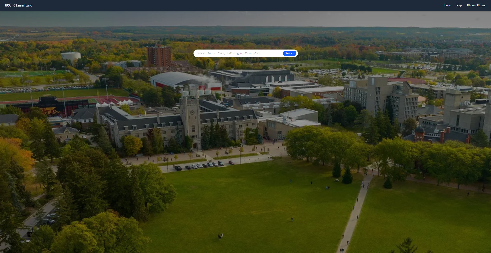
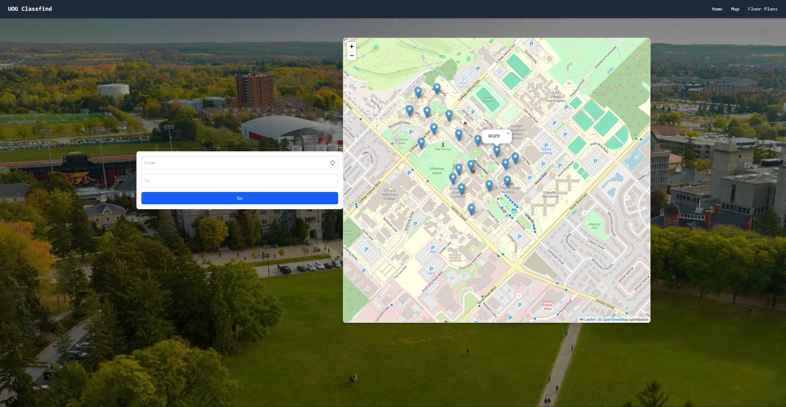

# UOG-Classfind

## Description

A web application for the University of Guelph campus that allows students to search for a classroom or building and be able to see the location on a map. The application also allows students to use their current location to find their building or classroom.

## Todo

- [x] ~~Add a search bar to the map to search for buildings or classrooms.~~
- [x] ~~Add a feature to show the current location of the user on the map~~.
- [x] ~~Add a feature to show the route from the user's current location to the selected building or classroom.~~
- [ ] Add indoor maps of buildings.
- [ ] Add indoor navigation to the application.

## Screenshots

## Technologies Used

- React
- Leaflet
- Tailwind CSS
- OpenStreetMap
